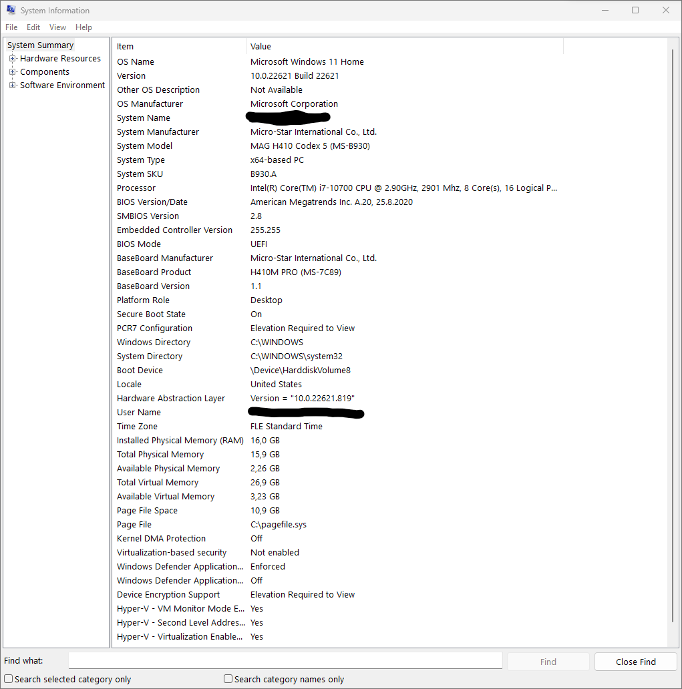
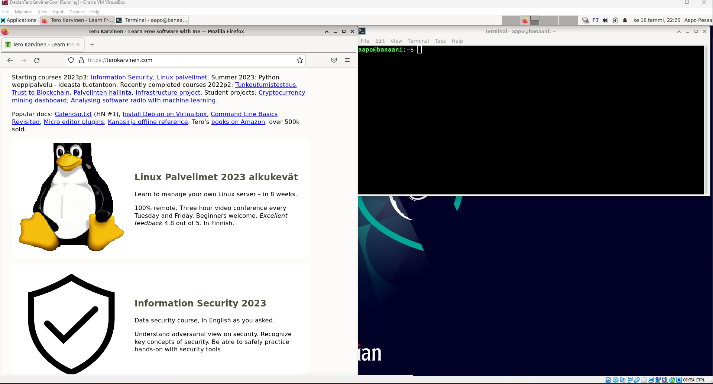

# h1 - raportti
## Asennuksen raportointi - Windows 11
- Tehtävänä on ladata Linux-käyttöjärjestelmän ISO-tiedosto, VirtualBox -käyttöympäristö ja alustaa virtuaalikone. Käyttöympäristö minulta löytyy jo entuudestaan, niin en raportoi sen asennusprosessia tarkemmin.

## Käyttämäni laitteisto

18.47 Työnteko alkaa

18.54 VirtualBox löytyy valmiiksi koneelta, debian ISO latautuu

19.04 Virtuaaliympäristön asetukset valittu, ensimmäinen boot

19.12 Laitteisto ja internet-yhteys toimii virtuaaliympäristössä

19.18 Debian installoidaan

19.23 Lataus valmis, uudelleenkäynnistys

19.27 Latasin uusimmat päivitykset ja käynnistin palomuurin komentokehotteella

19.47 Aloitan VirtualBox Guest Additionin latausprosessin

19.50 Kokonäyttö-näkymä toimii!

