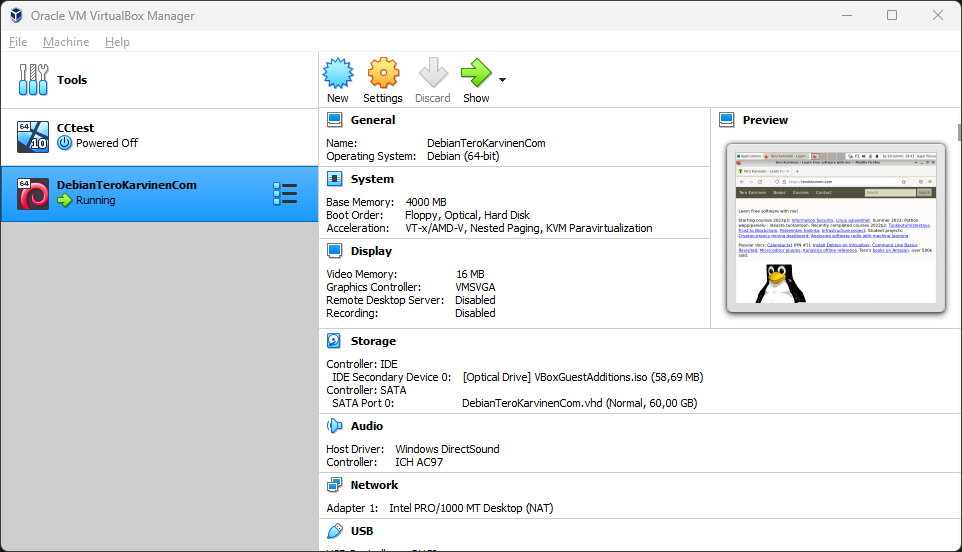
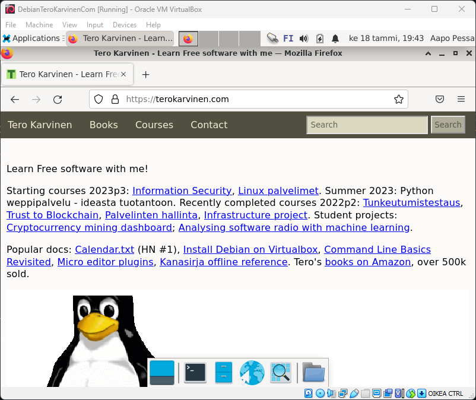
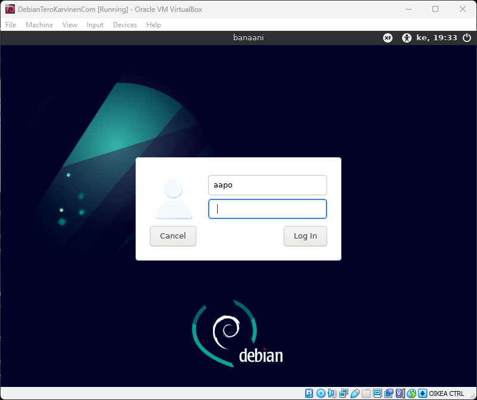
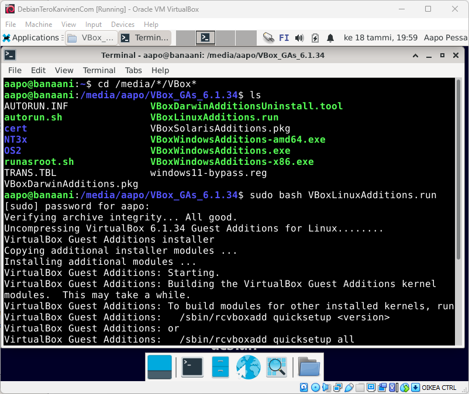

# h1 - raportti
## Asennuksen raportointi - Windows 11 

18.47 työnteko alkaa

18.54 virtualbox löytyy valmiiksi koneelta, debian ISO latautuu

19.04 virtuaaliympäristön asetukset valittu, ensimmäinen boot

19.12 laitteisto ja internet-yhteys toimii virtuaaliympäristössä

19.18 debian latautuu

19.23 lataus valmis, uudelleenkäynnistys

19.27 latasin uusimmat päivitykset ja käynnistin palomuurin komentokehotteella

19.47 aloitan VirtualBox Guest Additionin latausprosessin

