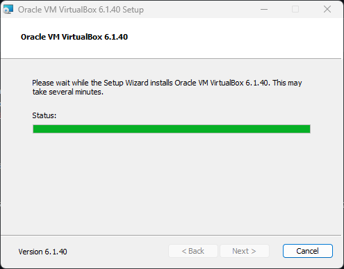
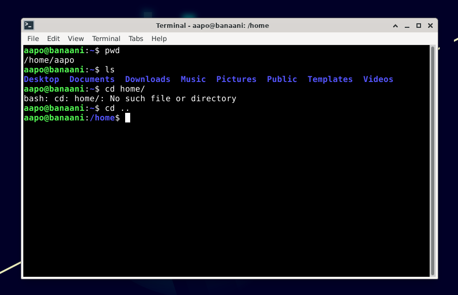
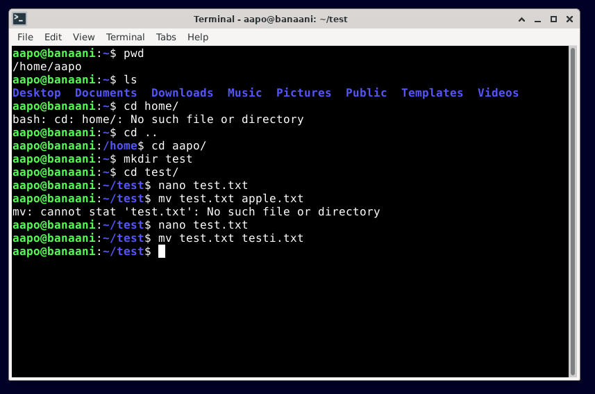
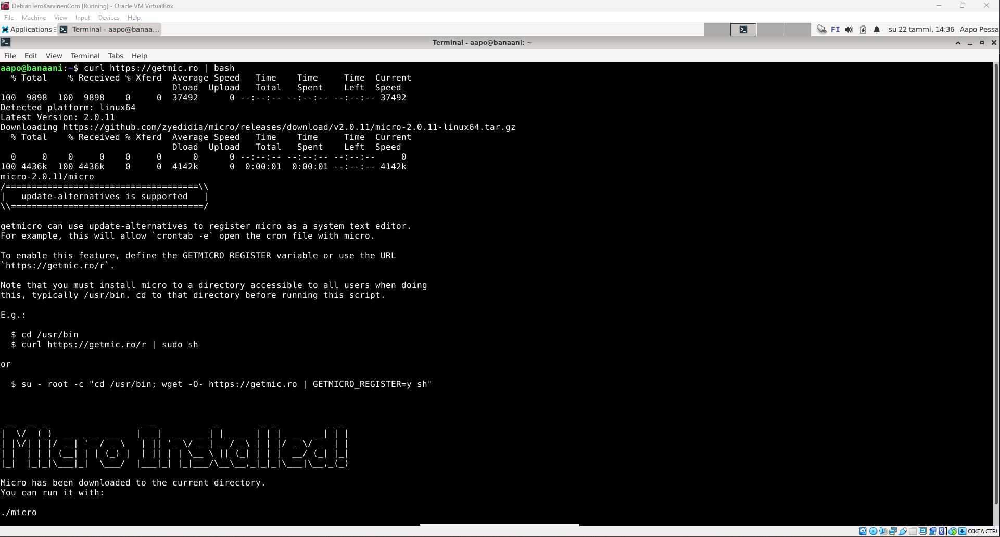
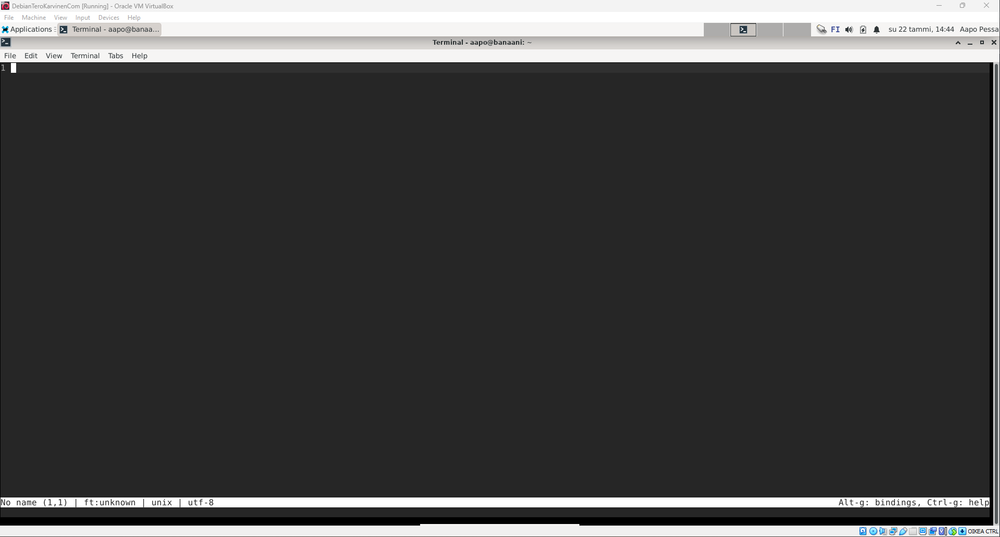
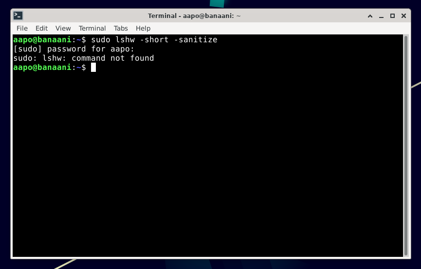

# h2 - Komentaja Pingviini
## 1. Tiivistelmä komentokehotteen perusteista (keskeisimmät toiminnot)
### Linuxin komentokehotteessa:
  - `pwd tulostaa nykyisen hakemiston nimen`
  - `ls tulostaa nykyisen hakemiston sisällön`
  - `cd -komennon avulla voit siirtyä hakemistosta toiseen esim. cd home/`
  - `cd .. -komennon avulla siirryt tason ylemmäs nykyisestä hakemistosijainnista`
  - `mkdir (kansion nimi) luo uuden hakemiston`
  - `mv siirtää tai uudelleennimeää tiedoston`
  - `cp kopioi tiedoston`
  - `rm poistaa tiedoston`
  - `rmdir poistaa hakemiston`

### Aikatiedot ja tapahtumienkulku
- Työskentely ja tehtävänannon lukeminen alkaa klo 13.50
- Käynnistän Oracle VirtualBox 6.1.34 -version klo 14.00
- Ruudulle tulee kehote uuden version lataamisesta, aloitan uudemman 6.1.40 -version latausprosessin
- 
- Uudemman version lataus onnistuu ja käynnistän ohjelman uudelleen
- Linux -ympäristö käynnistyy
- Kirjaudun sisään
- Kokeilen komentoja komentokehotteessa:
- 
- 
- Siirryn tehtävään 2: Micro-editorin lataaminen

## 2. Micro-editorin latausprosessi
- Navigoin selaimessa sivustoon https://github.com/zyedidia/micro#installation, joka selostaa Micro-editorin latausohjeet
- Käynnistän uudelleen komentokehotteen Linux-ympäristössä
- Ohjeissa "Quick-install script" -osion alla kehotetaan käyttäjää lataamaan koodieditori komennolla: `curl https://getmic.ro | bash` (curl -komennon avulla voidaan siirtää dataa serverille hyödyntäen tuettua protocollaa, tässä tapauksessa https) (geeksforgeeks)
- Suoritan `curl https://getmic.ro | bash` -komennon
- 
- Oletan, että lataus onnistui, mutta testaan vielä varmuuden vuoksi komennolla `./micro`
- 
- Toimii!
- Siirryn tehtävään 3: Raudan listaus klo 14.40

## 3. Raudan listaus
- Käynnistän komentokehotteen uudelleen
- Suoritan komennon: `sudo lshw -short -sanitize`
- Kehote pyytää salasanaa
- Annan salasanan
- 
- Navigoin sivulle: https://howtoinstall.co/en/lshw etsien ohjeita lshw:n lataukseen
- Suoritan komennon: `sudo apt-get install lshw` ja annan salasanan
- 
- Kokeilen komentoa: `sudo lshw -short -sanitize` uudelleen
- (kuva)
- Komento listaa käyttöjärjestelmän tiedot, ja niiden kategoriat (poislukien arkaluontoiden informaatio `-sanitize` -valinnan takia
- "Class" kategorisoi tiedon sen luonteen mukaisesti
- "Device" kertoo missä tietokoneen osassa tieto sijaitsee/pyörii
- "Description" kuvailee annettua metadataa

## 4. Apt - kolmen ohjelman samanaikainen lataus ja niiden testaus
- Etsin hakukonetta hyödyntäen kolme ladattavaa ohjelmistoa
- Valitsen nämä: cool-retro-term, Wikit ja Googler
- Voitaakseni ladata Wikit-ohjelmiston, minun tarvitsee ensin ladata `nodejs` ja `npm` komennolla `sudo apt install nodejs npm`
- (kuva)
- Yritän ladata kaikki kolme ohjelmaa komennolla: `sudo npm install wikit sudo apt-get install googler cool-retro-term`
- (kuva)
- En onnistunut lataamaan cool-retro-term ohjelmaa, koska se ei sisälly npm-rekisteriin
### Wikit
- Yritän ladata pelkästään Wikit-ohjelmiston komennolla: `sudo npm install wikit`
- (kuva)
- Tämänkaltainen installaatio altistaa laitteiston hakemalla ja antamalla oikeuksia epäluotettaville tahoille, joten installaation keskeytyy
- Kokeilen vaihtoehtoista latauskomentoa: `npm i wikit -g`
- (kuva)
- Kohtaan ongelmia käyttäjäoikeuksien kanssa

### Googler
- Etsin googler:in GitHub sivuston installaatio-ohjeita varten: 
- Suoritan komennon: `$ sudo curl -o /usr/local/bin/googler https://raw.githubusercontent.com/jarun/googler/v4.3.2/googler && sudo chmod +x /usr/local/bin/googler`
- (kuva)
- Käynnistän ohjelman komennolla: `googler`
- Testaan komenta syöttämällä oman nimeni: `Aapo`
- (kuva)
- Siirryn sivustolle: https://github.com/jarun/googler/wiki/What-to-do-when-you-encounter-%22No-results%22 etsimään ohjeita
- En onnistu ratkaisemaan ongelmaa joten etsin toisen, sopivamman ohjelmiston klo 16.20 (pidän tauon)

## Lähteet
- Karvinen T. Komentaja Pingviini. Luettavissa: https://terokarvinen.com/2023/linux-palvelimet-2023-alkukevat/#h2-komentaja-pingviini
- GitHub https://github.com/zyedidia/micro#installation
- geeksforgeeks. curl command in Linux with Examples. https://www.geeksforgeeks.org/curl-command-in-linux-with-examples/
- https://howtoinstall.co/en/lshw
- https://www.tecmint.com/cool-linux-commandline-tools-for-terminal/
- https://github.com/Swordfish90/cool-retro-term
- https://www.tecmint.com/wikipedia-commandline-tool/
- https://www.tecmint.com/google-commandline-search-terminal/
- https://github.com/KorySchneider/wikit
## Tekijä / Author
- Aapo Pessa
